# Automated 3D Cell Tracking and Division-Lineage Reconstruction in Living Plant Tissue
#### Reconstructing the complete division lineage of every surface cell in a developing plant organ, across a seven-timepoint 3D confocal time series, directly from raw instance segmentations.

#### ***Licensed under the GNU Affero General Public License v3.0 or later.*** See [LICENSE](LICENSE). Copyright (c) 2026 Javadian. All rights reserved.

### Source Code
Source code is not published yet in this public repo (except metric tests and demo). The implementation currently lives in a private repository at [git-ce.rwth-aachen.de/javadian/plantcell-tracking](https://git-ce.rwth-aachen.de/javadian/plantcell-tracking) (accessible by invitation only) and a publication based on this work is in preparation therefore the code will be published once it is out.
This repository currently holds the project report, result figures, and method documentation only. For questions, data access, or collaboration, please contact the repository owner through GitHub.

## Project

Type: `Research assistantship project.`  
Department: `The Chair of Imaging and Computer Vision (Lehrstuhl für Bildgebung und Bildverarbeitung, LfB), RWTH Aachen`.  
Supervisors: `Prof. Stegmaier, Zhu Chen`.  
Imaging data: `Tsiantis group, Max Planck Institute for Plant Breeding Research (specimen S10).`  

## Contents

1. [Introduction](#1-introduction)
2. [Challenges](#2-challenges)
3. [Dataset](#3-dataset)
4. [Data engineering](#4-data-engineering)
5. [Methods](#5-how-the-method-was-arrived-at-the-full-path-including-the-dead-ends)
6. [The current pipeline](#6-the-current-pipeline)
7. [Results](#7-results)
8. [Negative results](#8-negative-results-and-why-they-are-kept)
9. [Benchmark against the reference method](#9-benchmark-against-the-reference-method)
10. [Metric definitions](#10-metric-definitions)
11. [Validation protocol and limitations](#11-validation-protocol-and-limitations)
12. [Status and next phase](#12-status-and-next-phase)
13. [Technical stack](#13-technical-stack)
14. [Figure index](#14-figure-index)
15. [References](#15-references)

---

## 1. Introduction

A growing plant organ is imaged repeatedly by 3D laser-scanning confocal microscopy. Each frame is segmented into individual cells in three dimensions. The task is to follow every cell through the whole series: to decide which cell in frame *n* corresponds to which cell in frame *n+1*, and to detect the moments at which one cell divides into two or more daughters.

The output is a **lineage forest**: one branching family tree per founder cell at T0, recording every division event down to T6, so that each of the 1756 cells present at the end of the series can be traced back to the cell it came from.

This is a foundational measurement in developmental biology. It is what makes it possible to quantify growth rates per cell, map where and when divisions occur, and relate patterns of division to the shape the organ eventually takes.

The system is built end to end in Python and PyTorch and combines deformable registration, optimal transport, combinatorial optimisation over graphs, integer programming, and supervised learning.

  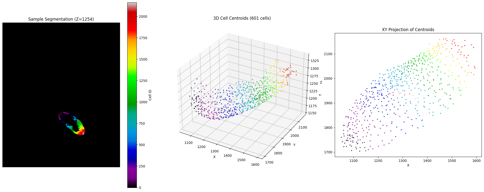 
  <em><b>Figure 6.</b> Left: one Z-slice of the 3D instance segmentation. Centre and right: the derived surface-cell point cloud in 3D and in XY projection, coloured by cell label. Everything downstream operates on this representation plus the per-cell descriptors derived from the voxel data.</em>

---

## 2. Challenges

Four properties compound, and each of them breaks a standard tracking assumption.

**The tissue deforms non-rigidly between frames.** The organ grows, bends, and stretches unevenly. A cell is at a different absolute position and in a different local arrangement from one frame to the next. Nearest-neighbour matching in the raw coordinate frame is meaningless before registration, and a rigid or affine registration is not sufficient because the deformation is elastic and spatially varying.

**Roughly 40 percent of cells divide between consecutive frames.** This is the central difficulty. A dividing cell must be matched to several children at once, which violates the one-to-one assumption that assignment algorithms and most learned matchers are built on. Detecting division correctly means deciding which *sets* of cells in the later frame are siblings descended from a common mother, which is a set-valued decision, not a pairwise one.

**Segmentation labels are assigned independently in every frame.** Cell 42 at T0 has nothing to do with cell 42 at T1. Identity cannot be read off the data. It has to be inferred from geometry, from neighbourhood structure, and from shape.

**The data are genuinely volumetric and large.** Each frame is 1782 x 2749 x 2227 voxels of uint16 labels, roughly 21.8 GB uncompressed, roughly 153 GB across the seven frames. Every preprocessing step has to stream over chunks rather than load volumes into memory.

  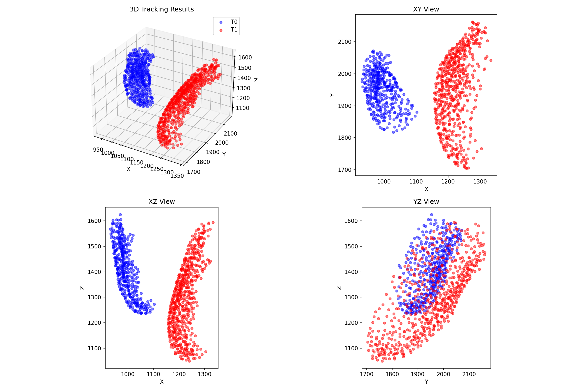 
  <em><b>Figure 4.</b> Two consecutive timepoints in their raw coordinate frames, shown in 3D and in the three axis projections. The two populations barely overlap. Nothing can be matched in this state, which is why registration is the first stage of the pipeline rather than an optional preprocessing nicety.</em>

---

## 3. Dataset

**Acquisition.** 3D laser-scanning confocal fluorescence microscopy of a membrane-stained plant shoot apex, one specimen, imaged at intervals of roughly 12 to 24 hours over seven timepoints (T0 to T6). Provided as per-frame 3D instance segmentations.

**Volume geometry.** 1782 x 2749 x 2227 voxels per frame, uint16 labels, chunked at 100 x 100 x 100. About 10.9 billion voxels per frame.

**Scope.** Surface (epidermal) cells only. The interior cells are removed during preprocessing, because the lineage ground truth and the biological question both concern the epidermis, and because carrying the full interior would multiply the cost of every stage for no gain.

### Population per timepoint

| Timepoint | Surface cells | Cells in full volume | Mean cell volume (voxels) | Wall-adjacency edges | Mean neighbours per cell |
|---|---|---|---|---|---|
| T0 | 421 | 422 | 5 636 | 2 774 | 6.6 |
| T1 | 598 | 601 | 12 379 | 4 308 | 7.2 |
| T2 | 850 | 855 | 16 078 | 6 190 | 7.3 |
| T3 | 1 211 | 1 222 | 20 152 | 8 552 | 7.1 |
| T4 | 1 022 | 1 022 | 34 242 | 5 930 | 5.8 |
| T5 | 1 185 | 1 185 | 42 643 | 6 944 | 5.9 |
| T6 | 1 756 | 1 756 | 38 871 | 9 862 | 5.6 |

Two things to read off this table. First, the surface counts and the full-volume counts differ slightly, because a small number of cells sit at the boundary of the surface criterion; all results below are reported on the surface subset. Second, T3 to T4 is a genuine decrease in surface cell count (1211 to 1022). Cells leave the surface between those frames, which means the matcher cannot assume every source cell has a child, and that is exactly why the unbalanced formulation of optimal transport was adopted rather than the balanced one.

### Ground truth lineage

One CSV per transition, giving child label in the later frame and parent label in the earlier frame. The files were cleaned before use to remove entries with no valid parent or no valid child, so that cells appearing from nowhere do not pollute the evaluation.

| Transition | Links | Parents | Single-child parents | Dividing parents | Max children from one parent |
|---|---|---|---|---|---|
| T0 → T1 | 598 | 422 | 253 | 169 | 4 |
| T1 → T2 | 836 | 435 | 158 | 277 | 5 |
| T2 → T3 | 1 171 | 666 | 294 | 372 | 7 |
| T3 → T4 | 936 | 676 | 456 | 220 | 4 |
| T4 → T5 | 1 175 | 901 | 675 | 226 | 4 |
| T5 → T6 | 1 756 | 547 | 232 | 315 | 31 |

### Division fan-out

The distribution of children per parent is what determines how hard the grouping problem is on each transition.

**T0 → T1** (the easy case): 253 parents with 1 child (60.0 percent), 163 with 2 (38.6), 5 with 3 (1.2), 1 with 4 (0.2). Mean 1.42 children per parent.

**T2 → T3** (the busy case): 294 with 1 (44.1 percent), 276 with 2 (41.4), 72 with 3 (10.8), 16 with 4 (2.4), and a tail out to 7.

**T5 → T6** (the anomalous case): 232 with 1 (42.4 percent), 109 with 2 (19.9), 54 with 3 (9.9), and a long tail reaching a single "parent" with 31 children. Mean 3.21 children per parent. A cell does not divide into 31 daughters in one interval. These entries are a segmentation or annotation artefact, and they are treated as such rather than modelled as biology; see section 8.

### Biological measurements taken from the data

- Cells grow substantially before dividing. The combined volume of the daughters relative to the mother sits in a band that was measured per transition rather than assumed, with centres of roughly 3.4, 2.6, 2.3, 2.2, 1.9 and 2.7 across the six transitions. An earlier single global figure of 2.8x was replaced once volumes were re-extracted consistently.
- Divisions are predominantly into two daughters, with a real minority into three and four.
- Mean cell volume climbs monotonically across the series, from 5 636 voxels at T0 to a peak of 42 643 at T5, which is growth and not a scale artefact, since the same extraction code produced every frame.
- Cell shape is stable across the series: elongation 0.24 to 0.31, flatness 0.17 to 0.20, anisotropy 0.38 to 0.45 (inertia-tensor descriptors). This stability is useful, because it means shape deviation is informative about division rather than about drift in imaging conditions.

---

## 4. Data engineering

None of this is the scientific contribution, but all of it had to exist and be correct before any method could be evaluated, and it accounts for a large part of the work.

**TIFF to zarr conversion.** The original stacks were TIFF. They were converted to chunked zarr stores so that the volumes could be read lazily, chunk by chunk, on a network filesystem. At 153 GB across the series this is the difference between a pipeline that runs and one that does not.

**Surface extraction.** A single streaming pass per timepoint over the cleaned full-volume zarr performs per-chunk 6-connectivity erosion, keeps only cells with voxels surviving in the surface shell, and writes three outputs at once: the surface-only zarr, the surface point cloud (centroids plus labels), and the per-cell volumes. Volumes come free, because the per-label voxel count needed for the centroid is the volume. Centroid and volume accumulation is vectorised with `bincount` rather than accumulating point lists, which was the difference between minutes and hours per frame.

**Real wall-sharing neighbour matrices.** Adjacency here is not a distance heuristic. A second streaming pass over the surface zarr counts, for every pair of cells, the number of shared boundary voxels under 6-connectivity, and stores the result as a sparse matrix whose entries are physical contact area. This is what makes it possible to say that two cells actually touch, as opposed to merely being close, and it is the graph the division candidate generator walks.

**3D shape descriptors.** Per-cell volume, elongation, flatness and anisotropy derived from the inertia tensor, computed in a streaming pass over the full volume for all seven timepoints.

**Ground truth cleaning.** The lineage CSVs were filtered to remove rows whose parent or child label does not exist in the corresponding segmentation, so that cells appearing from nowhere are not counted for or against the tracker.

**Centralised configuration.** All paths, all timepoints, all transitions and all tunable parameters live in a single config module with path-builder helpers. Every stage is written once and parameterised by `(src, dst)`, so the pipeline is identical for all six transitions and nothing is hard-coded to a specific frame pair.

---

## 5. How the method was arrived at (the full path, including the dead ends)

The final pipeline looks simple in outline. It is simple because several more elaborate approaches were built, measured, and eliminated first. Each elimination narrowed the design space, and the negative results are as much a part of the work as the positive ones. This section documents the path in the order it was taken; section 6 documents where it ended up.

### 5.1 Sparse-anchor rigid and affine registration

The first registration attempts followed the reference literature: pick a handful of confidently corresponding cells as anchors, compute FPFH descriptors, and fit a rigid or similarity transform with RANSAC, optionally refined with ICP (Open3D).

  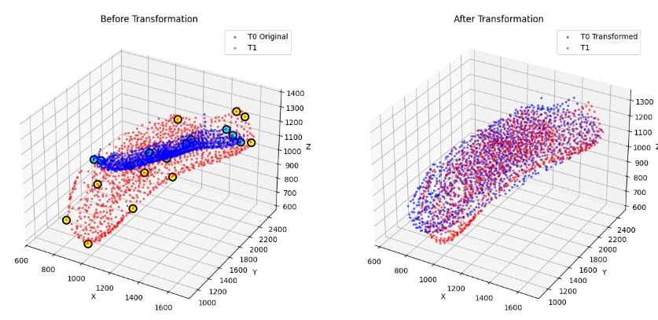 
  <em><b>Figure 1.</b> Early sparse-anchor registration. Left: the two timepoints before transformation, with the selected anchor pairs highlighted. Right: after the fitted transform. The gross offset is removed, but the two populations still do not coincide locally, which is the signature of a global transform applied to a locally deforming tissue.</em>

This works, up to a point, and its failure mode is instructive. On T0 → T1 with 10 anchors, RANSAC converged with fitness 1.0, 10 of 10 inliers, and an RMSE of 22.0 units, recovering a scale of about 1.54. Per-pair residuals after transformation ranged from about 5 to 20 units, which is on the order of a cell diameter, so the alignment is not accurate enough to match cells by proximity. On harder transitions the approach broke down entirely: on one transition only 3 of 10 selected anchor pairs survived label validation, below the 4 needed for RANSAC, and the procedure aborted.

Two conclusions carried forward. First, the transform class was wrong: the tissue does not move rigidly, so no global rigid or affine transform can align it. Second, anchor selection is not incidental, it is a first-class design variable (section 6.2).

### 5.2 Multi-view 2D projection matching

The next attempt tried to convert the 3D problem into a set of 2D problems, on the reasoning that 2D convolutional matching is mature and cell walls are visually distinctive.

The full apparatus was built. Maximum-intensity projections of the label volume were generated along the X, Y and Z axes at 12 angles each, giving 36 projections per timepoint and 108 across the three volumes involved. A wall extractor combining watershed boundaries, gradient-based detection and morphological boundary detection produced clean wall networks from each projection, with a fragmentation-repair stage in front of it. Everything was cached in zarr so individual projections could be reloaded without recomputation.

  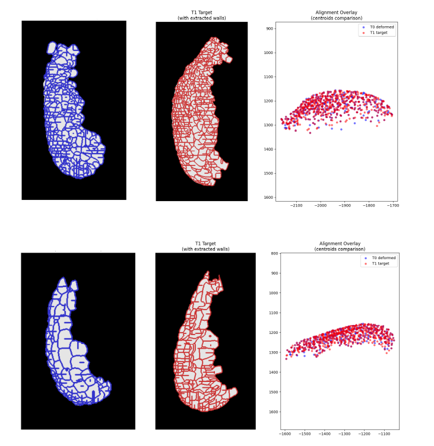 
  <em><b>Figure 14.</b> Extracted cell-wall networks from projections of the two timepoints, with the centroid alignment overlay on the right. The wall extraction itself works well. The overlay is the problem: after projection, the two populations are dense, overlapping clouds in which many cells are equally plausible partners.</em>

Matching then proceeded by voting: each cell was matched independently in each of the projections, and the votes were combined into a consensus.

  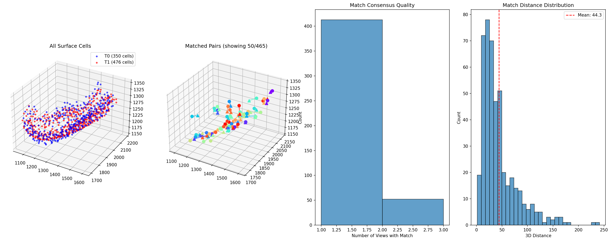 
  <em><b>Figure 3.</b> Multi-view consensus diagnostics on the first transition. The third panel is the decisive one: the overwhelming majority of matches are supported by a single view, with almost none agreeing across views. The fourth panel shows the resulting match distances, with a mean of 44.3 units, far above the cell spacing.</em>

  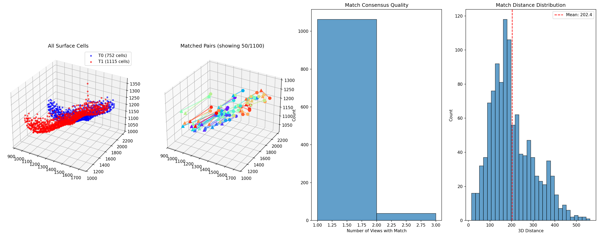 
  <em><b>Figure 2.</b> The same diagnostics on a harder transition. Consensus collapses further and the mean match distance rises to 202.4 units. The projection approach degrades exactly where the tracking problem gets harder.</em>

Quantitatively, the first version reached 8.3 percent overall accuracy (34 of 253 one-to-one relationships correct, 1 of 169 divisions). An optimised second version reached 19.0 percent (75 of 253 one-to-one, 5 of 169 divisions). Inter-view agreement was about 21 percent.

A parallel line of investigation asked whether the projections themselves could be made better, by comparing full projections against half-depth projections and single slices.

  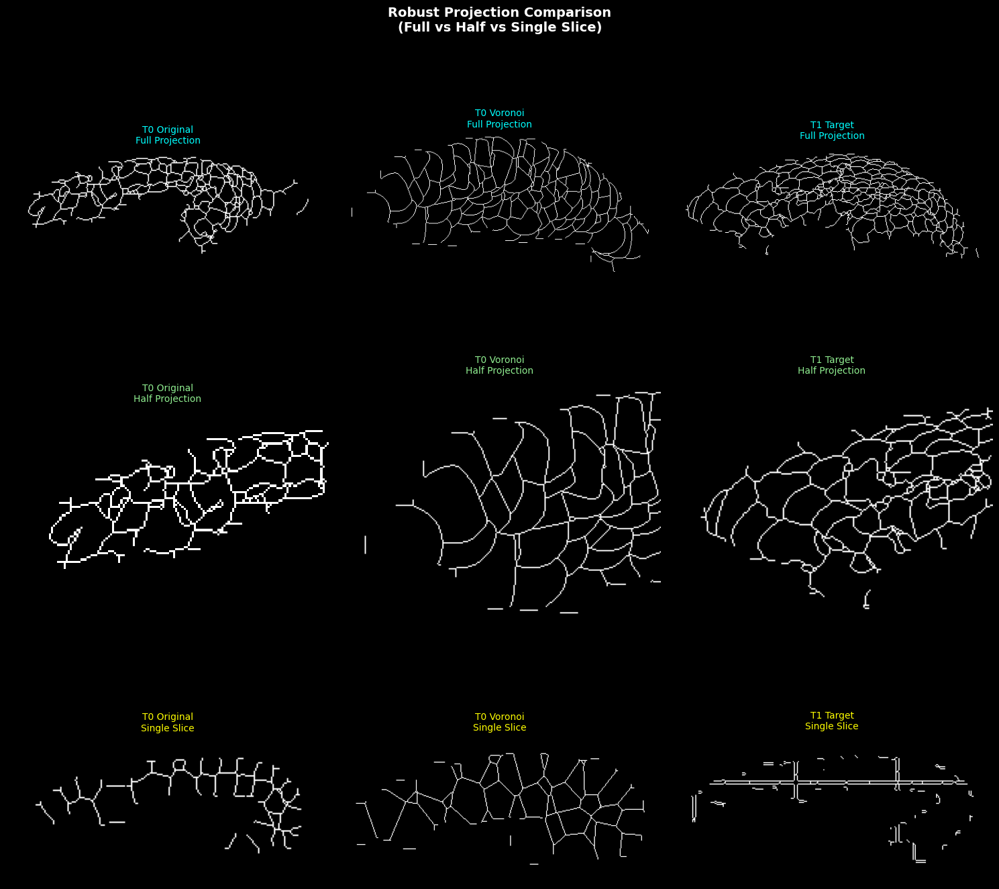 
  <em><b>Figure 15.</b> Projection depth study. Full projection (top), half projection (middle), single slice (bottom), for the source volume, a Voronoi-reconstructed version of it, and the target volume. Full projections superimpose walls from the whole depth into an unreadable tangle; single slices are clean but describe a single plane rather than the tissue. There is no depth setting at which a projection is both readable and representative.</em>

A related problem appeared when the deformation was applied to the voxel volume rather than to the centroids. Warping individual voxels independently tore the cells apart, producing a porous, disconnected volume.

  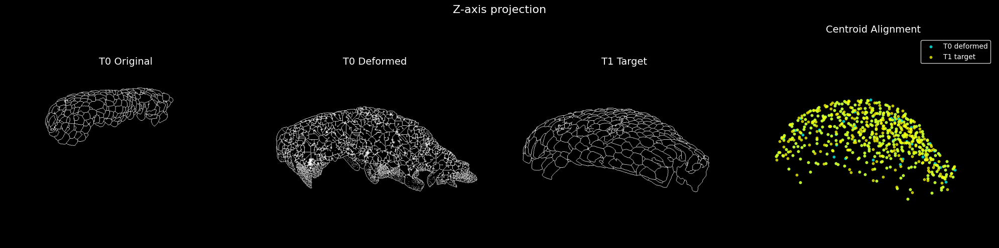 
  <em><b>Figure 10.</b> Z-axis projection of the source volume, the same volume after voxel-wise deformation, and the target volume, with the centroid alignment at right. The deformed volume in the middle panel is visibly fragmented. Three repair strategies were tried: pixel-wise warping (failed, walls break), vertex-based convex-hull reconstruction (failed, expensive and fragmentary), and Voronoi reconstruction assigning each voxel to its nearest deformed centroid (worked, clean and fast). The Voronoi version is the middle column in Figure 15.</em>

**Verdict: abandoned.** Projection discards depth, and depth is precisely the information that separates a cell from its neighbours in a tightly packed epidermis. The approach was over-engineered for a problem that, as the next section shows, is far better posed directly in 3D. This was the single largest course correction in the project, and making it early was worth more than any incremental gain would have been.

### 5.3 Graph representation study

With projections abandoned, the question became how to represent the tissue as a graph, since neighbourhood structure is the obvious source of information beyond position.

  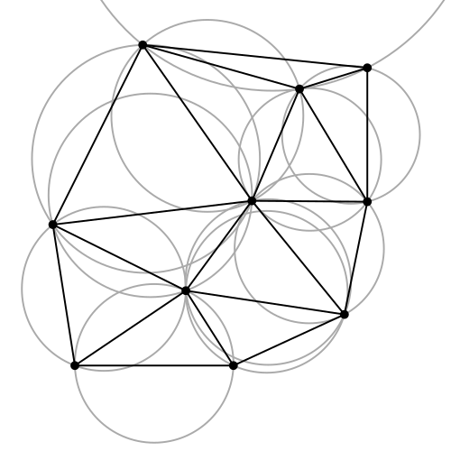
  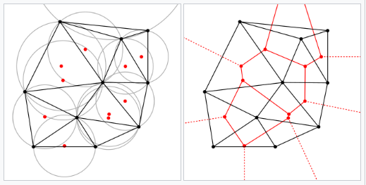 
  <em><b>Figures 13 and 12.</b> Delaunay triangulation with its empty-circumcircle property, and the duality between the Delaunay triangulation (black) and the Voronoi diagram (red). Plant tissue tiles space in a Voronoi-like way, so the Delaunay dual is a natural candidate for cell adjacency.</em>

Three candidate definitions of adjacency were compared: Delaunay triangulation (geometrically principled, adapts to local density, no distance threshold to tune, but creates spurious long edges in sparse regions), k-nearest neighbours by centroid distance (cheap and controllable, but can connect cells separated by other cells), and true wall-sharing adjacency measured from the voxel data.

The project ultimately computes true wall-sharing adjacency, because it is the only definition that is physically correct, and it is available given that the full segmentation is on disk. The k-nearest-neighbour graph is retained as a second definition, and the difference between them turned out to matter in an unexpected way (section 8, GSM).

### 5.4 First learned matcher: GCN plus GAT on Delaunay graphs

An early graph neural network was built on Delaunay graphs of the cell centroids: 8-dimensional node features (3D coordinates, distance from tissue centroid, normalised coordinates, local density), two GCN layers with residual connections, one multi-head GAT layer, a shared Siamese encoder for the two timepoints, a pairwise similarity matrix, and a matching head. Training used focal loss and positive weighting to handle the extreme class imbalance, with regional batching (2 x 2 x 2 regions with 30 percent overlap) to keep the pairwise matrices tractable.

Results: spatial nearest-neighbour baseline 32.5 percent, GNN with greedy matching 31 percent, GNN with Hungarian assignment 37.5 percent. The learned model was worth about 5 points over the distance baseline, on an absolute scale where all three were poor.

The reason all three were poor is that this was run **before the deformable registration worked**. The lesson taken from it was that a learned matcher cannot compensate for a bad coordinate frame, and that fixing registration had to come first. It did, and it changed everything: after deformable registration, the same distance baseline that scored 32.5 percent here reaches above 90 percent.

---

## 6. The current pipeline

Four stages. Registration, one-to-one matching, division detection, forest assembly.

### 6.1 Deformable registration

Consecutive timepoints are brought into a common coordinate frame by a deformable (non-rigid) registration built on radial basis functions, in thin-plate-spline form. Confident one-to-one correspondences act as anchors; the warp is fitted through them and applied to every source cell. On the harder transitions this is preceded by an affine pre-alignment, with the RBF fitted to the affine residual, so the spline only has to explain the local, non-uniform part of the deformation.

  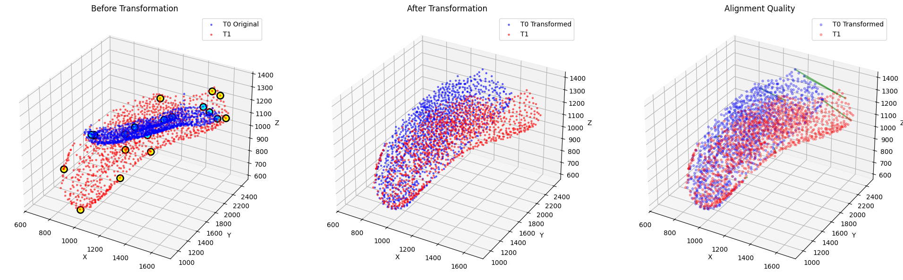 
  <em><b>Figure 7.</b> Deformable registration on the full point set. Before, after, and the alignment-quality overlay. Compare against Figure 1: the two populations now coincide throughout the tissue, not merely on average.</em>

  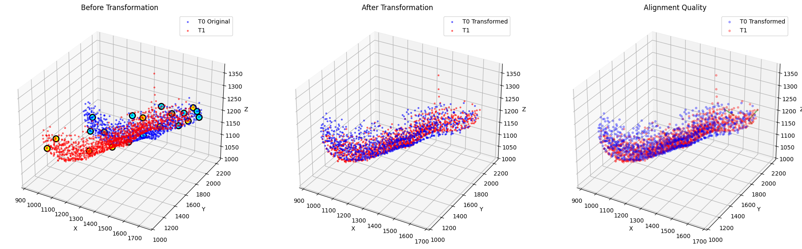 
  <em><b>Figure 8.</b> The same registration on the surface-cell subset, which is what the tracker actually consumes.</em>

  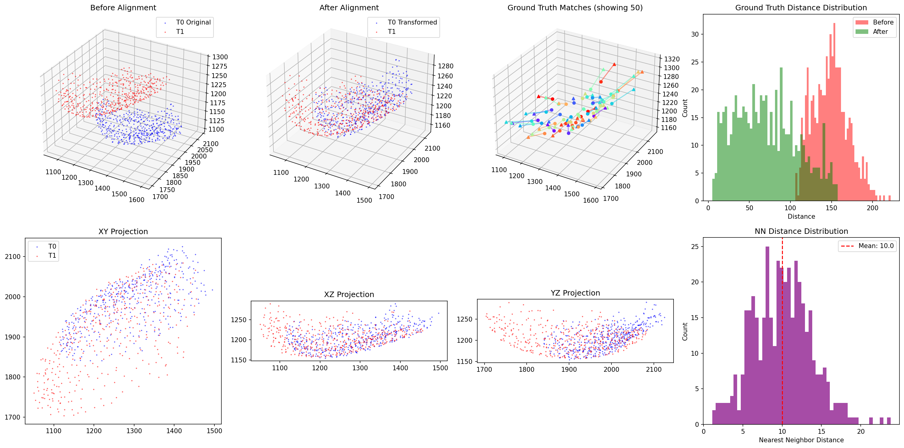 
  <em><b>Figure 5.</b> Quantitative alignment assessment. Top row: before, after, ground-truth correspondence vectors, and the distribution of ground-truth pair distances before (red) and after (green) registration. Bottom row: the three axis projections and the nearest-neighbour distance distribution, with a mean of 10.0 units, which sets the length scale for everything downstream. The green distribution shifting cleanly below the red one is the result: after registration, corresponding cells are close, and the residual spread is dominated by division children that have genuinely moved apart.</em>

After registration, nearest-parent assignment alone recovers about 93 percent of children on a healthy transition. Registration is effectively solved for five of the six transitions.

### 6.2 Anchor study

Because the early RANSAC work showed anchor selection to be a first-class variable, it was studied directly rather than left to a default.

  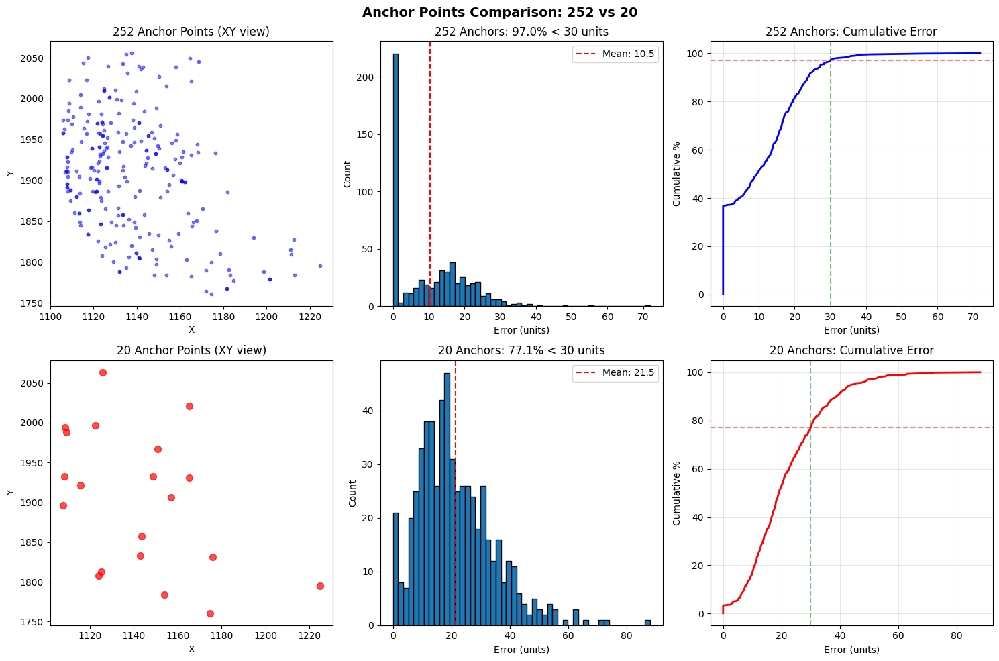 
  <em><b>Figure 9.</b> Anchor-count comparison. Top row, 252 anchors: spatial layout, error histogram (mean 10.5 units), and cumulative error, with 97.0 percent of cells under 30 units. Bottom row, 20 anchors: mean error 21.5 units and 77.1 percent under 30 units, with a long tail of badly constrained cells.</em>

Anchor *selection* was then swept independently of anchor count: eight strategies, anchor
counts from 5 to 100, scored on registration success rate at two thresholds and on mean
registration error.

  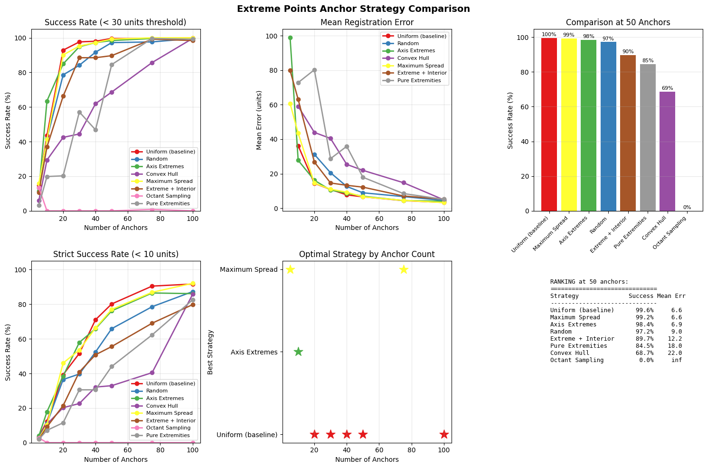 
  <em><b>Figure 16.</b> Anchor selection strategy sweep. Top left: success rate under a
  30-unit threshold against anchor count. Bottom left: the same under a strict 10-unit
  threshold. Top centre: mean registration error. Top right and the ranking table: the
  head-to-head comparison at 50 anchors. Bottom centre: which strategy wins at each anchor
  count.</em>

| Strategy at 50 anchors | Success rate | Mean error (units) |
|---|---|---|
| Uniform coverage | 99.6 % | 6.6 |
| Maximum spread | 99.2 % | 6.6 |
| Axis extremes | 98.4 % | 6.9 |
| Random | 97.2 % | 9.0 |
| Extreme plus interior | 89.7 % | 12.2 |
| Pure extremities | 84.5 % | 18.0 |
| Convex hull | 68.7 % | 22.0 |
| Octant sampling | 0.0 % | diverged |

Three findings, and each of them is counterintuitive in the same direction.

**Spatial coverage dominates individual anchor quality.** The three strategies that spread
anchors evenly through the tissue volume (uniform, maximum spread, axis extremes) are the
top three, and they beat every strategy that selects anchors by a property of the anchors
themselves. A separate earlier comparison made the point even more sharply: selecting the 50
anchors with the smallest measured displacement, which is the intuitive definition of the
"best" anchors, scored 25 percent success with a mean error of 353 units. Those anchors
cluster in the stable regions and leave the strongly deforming regions completely
unconstrained, and the spline then extrapolates catastrophically outside the anchor hull.
Choosing the anchors that look most reliable is the worst thing you can do.

**Boundary-only strategies fail.** Convex hull (68.7 percent) and pure extremities (84.5
percent) place anchors on the outside of the tissue, which is exactly where a thin-plate
spline needs them least. The interior is left to interpolation across the widest possible
span. Octant sampling degenerated entirely, returning zero success and unbounded error,
because it can select nearly coincident anchors within an octant and produce a singular
system.

**The gains saturate early.** Every viable strategy is above 97 percent by 50 anchors, and
uniform selection is already above 90 percent at 20. Beyond roughly 30 anchors the curves
flatten and additional anchors buy almost nothing at the 30-unit threshold. The strict
10-unit panel is where the strategies stay separated for longer, which is the relevant regime
if sub-cell registration accuracy is required.
### 6.3 One-to-one matching

Two non-learned matchers are implemented and compared on every transition.

**Hungarian assignment** on the post-registration distance cost, with a search radius, solving the global optimal one-to-one assignment.

**Unbalanced optimal transport** (entropic Sinkhorn, via POT). Optimal transport is the natural formulation here: the source cells are a mass distribution, the destination cells are another, and the coupling matrix moves mass at minimum cost. The *unbalanced* variant relaxes the marginals, which allows mass to appear and disappear rather than forcing a bijection. That matters concretely: T3 → T4 loses surface cells, and a balanced formulation would be forced to invent correspondences for them.

Both matchers reach 98 to 100 percent precision on the cells they call one-to-one, across all healthy transitions. **One-to-one matching needs no learning.** After a correct deformable registration, distance is sufficient, and this is a positive result rather than a concession: it localises the entire remaining problem to divisions and lets all the learning effort go there.

The tuning sweep over the two optimal-transport regularisation parameters also produced an honest finding: unbalanced OT wins clearly on T0 → T1 (76.3 versus 67.5 percent division-perfect) but does not generalise with one setting across all transitions, collapsing on T3 → T4 precisely because the loose source marginal lets parents drop children on the transition that already loses cells. The pipeline therefore selects the matcher per transition rather than pretending one dominates.

### 6.4 Division detection

This is the core of the work, and it is a three-step structure: generate, score, commit.

**Generate.** For each candidate mother, propose candidate sibling groups by enumerating connected subgraphs of the wall-adjacency graph among cells near the mother's registered position. The biological justification is direct: daughters of a common mother share a wall immediately after dividing, and this was measured to hold for 96 to 99 percent of true groups. Enumeration is complete for connected subsets up to size 6, pruned by two monotone, biologically grounded bounds: the group's spatial extent must fit inside the search region, and its combined volume must fall in the transition's measured grown-mother band. Completeness under monotone pruning is what makes this tractable, around 9 candidate groups per mother, with no combinatorial blow-up. The seed set is additionally augmented with assignment-based seeds, so that daughters displaced beyond a fixed radius are still reachable.

**Score.** Each candidate group is scored by a small supervised MLP, referred to as the gate. Its inputs are eight group-level features, all computed in the same aligned frame so that no coordinate-frame mismatch can corrupt them: combined volume ratio, fit of that ratio within the transition's measured band, distance from the group centroid to the mother's registered centroid, group compactness, wall-connectivity, group size, coefficient of variation of the child volumes, and whether grouping improves on the children's individual nearest-parent distances. Training uses ground-truth sibling sets as positives and deliberately hard negatives: true groups with one sibling swapped, added, or removed, plus random wall-connected clusters near a mother. Splits are parent-disjoint, and separation on held-out parents is verified before any matching number is trusted.

**Commit.** The winning groups are selected globally, not greedily. Choosing groups by descending score kills a true group whenever a slightly higher-scoring wrong group steals one of its children, and both children then fall back to being called one-to-one. The commit step is therefore posed as a weighted set-packing problem and solved exactly as an integer linear program: maximise total gate score subject to each child belonging to at most one committed group and each mother being used at most once. A conflict-aware greedy solver is retained as a fallback when the ILP solver is unavailable.

### 6.5 Lineage forest

The six per-transition results are chained into a single forest, one tree per T0 founder, recording every division event. Because the matchers have different strengths per transition, the forest builder takes a per-transition method specification, and two variants are maintained: a division-optimal chain and a recall-optimal chain, since division-perfect and overall recall do not peak at the same operating point.

---

## 7. Results

### 7.1 One-to-one matching

Solved. 98 to 100 percent precision on cells called one-to-one, across all healthy transitions.

### 7.2 Division-perfect accuracy per transition

Division-perfect is the strictest available metric: a dividing parent counts only if *every* one of its daughters is placed exactly right. Getting two of three siblings correct scores zero.

| Transition | Dividing parents | Hungarian | Unbalanced OT | Learned gate | Best |
|---|---|---|---|---|---|
| T0 → T1 | 169 | 67.5 % | **76.3 %** | 73.4 % | 76.3 % |
| T1 → T2 | 277 | 37.9 % | 39.4 % | **50.9 %** | 50.9 % |
| T2 → T3 | 372 | 44.9 % | 43.0 % | **47.6 %** | 47.6 % |
| T3 → T4 | 220 | 63.6 % | 25.9 % | **65.5 %** | 65.5 % |
| T4 → T5 | 226 | **57.5 %** | 55.8 % | 57.1 % | 57.5 % |
| T5 → T6 | 315 | 3.8 % | 2.9 % | **6.0 %** | 6.0 % |

The learned gate gives the largest gains exactly where the non-learned matchers are weakest: +11.5 points on T1 → T2, +2.7 on T2 → T3, +1.9 on T3 → T4.

### 7.3 Overall recall per transition

| Transition | Hungarian | Unbalanced OT | Learned gate |
|---|---|---|---|
| T0 → T1 | 92.5 % | 93.8 % | 88 to 94 % |
| T1 → T2 | 73.9 % | 70.9 % | 70.6 % |
| T2 → T3 | 78.1 % | 75.1 % | 69.7 % |
| T3 → T4 | 91.3 % | 79.4 % | 87.8 % |
| T4 → T5 | 91.0 % | 89.5 % | 86.6 % |
| T5 → T6 | 30.1 % | 24.1 % | 25.1 % |

Division-perfect and overall recall trade off against each other. At its default operating threshold the gate over-commits divisions, which lifts division-perfect and costs a few points of recall. Which is the right operating point depends on what the lineage is for, so both are reported rather than one being quietly selected.

### 7.4 The bottleneck was candidate generation, not the classifier

This is the most useful analytical result in the project.

The gate discriminates extremely well: AUC 0.998 on T0 → T1, 0.962 on T1 → T2, 0.961 on T2 → T3, 0.900 on the repaired T5 → T6. Despite that, division-perfect on the hard transitions was stuck around 44 percent. The reason is that the gate cannot select a group it is never offered. Coverage, the fraction of dividing parents whose true sibling group is generated as a candidate at all, is a hard ceiling on division-perfect.

The original generator emitted only breadth-first prefixes of each cell's neighbourhood. In dense tissue, where true siblings sit inside connected wall-clusters of 20 to 80 cells, the correct 3-daughter or 4-daughter subset was frequently never enumerated. Coverage collapsed with division degree: on T1 → T2 it fell from about 90 percent for 2-daughter divisions to 70 percent for 3-daughter and 48 percent for 4-daughter.

Rebuilding the generator as bounded-complete connected enumeration lifted coverage substantially:

| Transition | Coverage, old generator | Coverage, new generator |
|---|---|---|
| T0 → T1 | 93 % | 93 % (after tuning) |
| T1 → T2 | 81 % | **93 %** |
| T2 → T3 | 78 % | **90 %** |
| T3 → T4 | 94 % | 92 % |
| T4 → T5 | 91 % | 91 % |
| T5 → T6 | 26 % | 48 % (still capped) |

The decisive observation: **the gate's AUC on T1 → T2 was identical, 0.962, before and after the generator change, while division-perfect rose from about 44 to 50.9 percent.** Same model, same weights, better candidates. That isolates the bottleneck unambiguously and redirected the next phase of work away from heavier decision models.

### 7.5 Registration diagnosis on the failing transition

T5 → T6 is the one transition where registration itself fails, and diagnosing it required correcting a measurement error that had gone unnoticed.

The original alignment quality figure was a residual of zero for one-to-one cells. That number means nothing: an interpolating RBF reproduces its own anchors at zero by construction, so measuring residual on the anchors measures the interpolant, not the registration. A held-out test was written to fix this: fit the spline on a subset of the one-to-one anchors, measure the residual on the anchors it never saw. Expressed in units of median cell spacing, so the number is comparable across transitions with different cell sizes:

| Transition | Held-out one-to-one residual |
|---|---|
| T3 → T4 (healthy) | 0.12 x spacing |
| T5 → T6 (failing) | 1.31 x spacing |

More than a full cell diameter of error on held-out cells. The cause is anchor sparsity: in regions where almost every cell divided, there are almost no one-to-one correspondences left to constrain the local warp.

The fix targets that cause directly, and uses no ground truth. Affine pre-alignment from the one-to-one anchors, thin-plate RBF on the affine residual, then a bootstrapping round in which confident division groups proposed from the first-round warp contribute pseudo-anchors mapping each mother to the centroid of its proposed daughters, planted exactly in the regions that had none. Ground truth is used only to score the result, never to fit it.

Effect on T5 → T6, before and after repair: any-overlap 26.7 to 51.1 percent, child accuracy within divisions 22.5 to 43.5 percent, overall recall 16.4 to 24.8 percent, gate AUC 0.871 to 0.900. Combining this with assignment-based region augmentation moved the fraction of dividing parents whose children are all reachable from 44 to 65 percent, and candidate coverage from 34 to 48 percent. The repair is correctly inert on the healthy transitions, producing no regression anywhere else.

### 7.6 End-to-end lineage forest

Chaining the six transitions produces a complete forest over the series.

| Forest variant | Founders | Lineages reaching T6 | Division events | Cells with a track, T0 to T6 |
|---|---|---|---|---|
| Division-optimal | 421 | 156 | 1 854 | 421 / 598 / 850 / 1 211 / 1 022 / 1 185 / 1 756 |
| Recall-optimal | 421 | 155 | 1 633 | as above |

Per-transition errors compound multiplicatively over six steps, so the number of founders with a fully correct six-step lineage is limited by the weakest link in the chain, currently T5 → T6. The forest is a working, improvable end-to-end system, and it is reported as such.

One result worth flagging as a trap for anyone reading these numbers: an all-OT chain produces *more* lineages reaching T6 (233), but only because it drops several hundred real cells at the final step, so more of the survivors happen to be intact. That is survivorship, not accuracy, and the per-transition-best forest is the correct one to keep.

---

## 8. Negative results, and why they are kept

Several substantial components were built, measured, and rejected. They are documented here rather than deleted, because in each case the measurement itself is a finding about the data.

**Multi-view 2D projection matching.** 8.3 percent, then 19.0 percent after optimisation, with 21 percent inter-view agreement. Projection destroys the depth information that separates neighbouring cells in a packed epidermis. See section 5.2.

**Volume in the spatial matching cost.** Adding volume terms to the assignment cost dropped accuracy to 23.9 percent, below distance alone. Morphology helps *classify* divisions and hurts *spatial assignment*, so volume enters the pipeline as a group-level gate feature and a prior, never in the matching cost.

**Graph similarity matching, three versions.** The reference method's central idea is to match a cell by comparing its local neighbourhood graph across time. Three architectures were built: a pooled Siamese embedding with pairwise BCE (validation accuracy 0.50 to 0.68, at base rate); a per-node correspondence model with a dual point-wise and graph-level loss and self-attention (the ranking loss flatlined at ln 16, the score head choked gradient flow to the encoder, and the no-match class diluted the softmax); and a position-plus-triplet variant with node correspondence dropped.

All three failed, and a read-only probe established why, in a way that is a property of the data rather than of the implementation. **When a mother divides, each daughter is surrounded by its own siblings and touches none of the mother's former neighbours.** Asking "which cell has a neighbourhood resembling the parent's" therefore has no signal for exactly the cells the project cares about. Measured embedding separation between true and wrong parents, for division children: 0.071 on the distance k-nearest-neighbour graph, 0.044 on the wall-sharing graph, against a one-to-one control of 0.239 and a threshold of about 0.15 for a usable signal. Two graph definitions, three architectures, one conclusion. The neighbour-correspondence idea is closed on this data by its own mechanism, and this negative result is what redirected effort to group-level reconstruction, which is where the signal actually lives.

  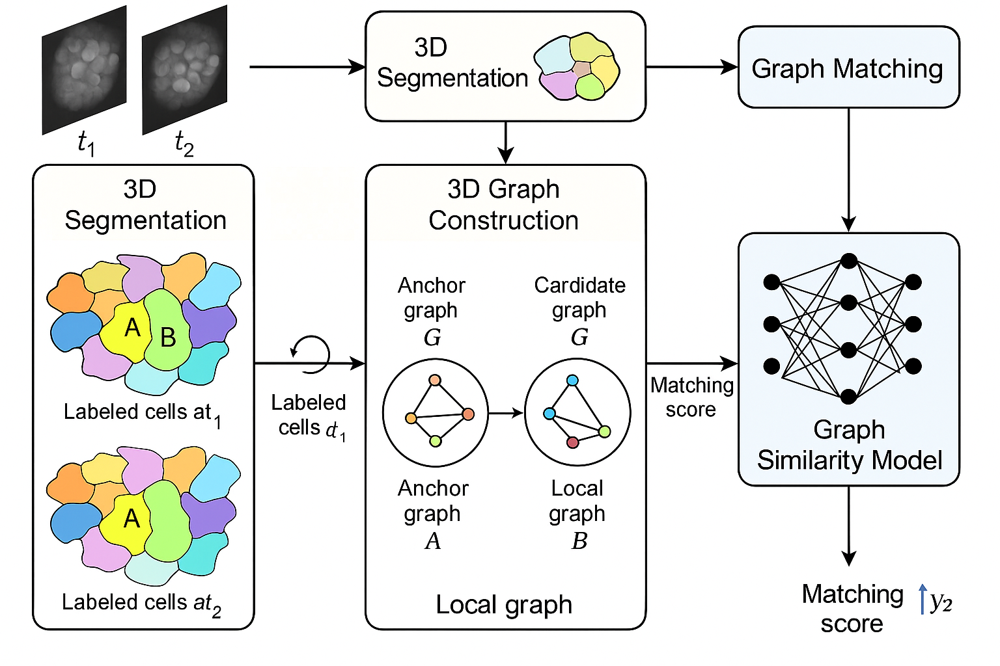 
  <em><b>Figure 11.</b> Schematic of the reference graph-similarity approach: segment both frames, build local k-nearest-neighbour graphs around an anchor cell and around each candidate, and score anchor-candidate graph pairs with a learned similarity model. This architecture was implemented and evaluated on this dataset. Illustration is schematic and was generated for this report.</em>

**Wall-adjacency post-correction.** A training-free topology check intended to repair committed division errors by enforcing neighbour conservation. It was run on both matchers across all six transitions and was net negative on every single one, for example T0 → T1 76.3 to 65.1 percent and T2 → T3 44.9 to 34.4 percent. Diagnosed causes: with 5 to 7 neighbours per cell, a wall-sharing trigger fires on almost any adjacent pair, and the volume gate it relied on was using a stale global growth constant instead of the per-transition measured bands. Rejected as applied to matcher output.

**Voxel shape as a gate feature.** A shape probe confirmed that voxel-overlap between the mother and the combined daughters carries real signal (separation +0.141, excess 0.64 versus 0.78). Added naively as a gate feature it *reduced* division-perfect from 44 to 23 percent, because it requires careful voxel frame alignment that the aligned-feature design of the gate had deliberately avoided. The signal is real and remains the strongest candidate for the next phase; the naive integration is not.

**Alternative candidate generators.** Volume-anchored group growth reached a 57 percent ceiling and per-cell membership scoring reached 72 percent even with an oracle, both below the 81 percent ceiling of whole-group connected enumeration. Measuring the ceiling of each generator before building a model on top of it prevented two wasted implementation cycles.

**Heavy-tail ground truth on T5 → T6.** One recorded parent has 31 children, and 121 of 315 dividing parents on that transition carry implausible fan-out. A cell does not produce 31 daughters in one interval, so these are treated as segmentation or annotation artefacts. They cap division-perfect on that transition regardless of tracking quality, and an audit to quantify the artefact-excluded figure is the top open item.

---

## 9. Benchmark against the reference method

The closest published method is Islam et al. (2023), which learns deformable 3D graph similarity to track plant cells in unregistered time-lapse images. Its results are on a different dataset, so this is indicative rather than a controlled comparison.

One correction from the literature review matters more than the comparison itself. The headline figure usually quoted from that line of work, 85 to 95 percent, is **one-to-one matching accuracy**, which is the part this project already solves at 98 to 100 percent precision. The paper's actual **cell-division recall is 50.6 percent**. Beating the state of the art on this problem therefore means beating roughly 50 percent division detection while holding one-to-one, not chasing 85 percent.

| Task | Islam et al. (3D) | This project |
|---|---|---|
| Pairwise one-to-one matching | P 0.989 / R 0.959 / F1 0.974 | 98 to 100 % precision per transition |
| Cell-division recall | 0.506, measured per daughter | 50.9 % on T1 → T2 and 76.3 % on T0 → T1, measured per parent, all-or-nothing |
| Long-time lineage accuracy | 70.99 % | Full T0 → T6 forest assembled, purity limited by T5 → T6 |

The comparison is conservative in this project's favour, because the two division metrics are not equally strict. The reference measures per daughter; the primary metric here is all-or-nothing per parent. The directly comparable lenient measure, child accuracy within divisions, is 94.5 percent on T0 → T1 and 74.2 percent on T1 → T2. Even under the stricter metric, this pipeline already meets the reference on the hard transition and exceeds it on the easy one.

---

## 10. Metric definitions

Several different denominators are in use, and conflating them produces meaningless comparisons, so they are defined explicitly.

| Metric | Definition |
|---|---|
| **Overall recall** | Of all child cells, the fraction assigned the correct parent |
| **One-to-one precision** | Of cells the tracker called non-dividing, the fraction that are correct |
| **Division-perfect** | Of dividing parents, the fraction for which *every* daughter is exactly right. Strictest |
| **Any-overlap** | Of dividing parents, the fraction with at least one correct daughter |
| **Child accuracy in divisions** | Of all daughters of dividing parents, the fraction placed correctly. Closest analogue to the reference paper's per-daughter division recall |
| **Coverage** | Of dividing parents, the fraction whose true sibling group is generated as a candidate at all. A hard ceiling on division-perfect |
| **Missed-as-one-to-one** | Dividing parents the tracker committed to a single child |

---

## 11. Validation protocol and limitations

Stated plainly, because they determine how the numbers above should be read.

**The registration is fitted on ground-truth one-to-one correspondences.** The RBF anchors come from known parent-child pairs. This is why registration quality is high, and it means the pipeline as evaluated is not yet a fully ground-truth-free tracker. The bootstrapped pseudo-anchor stage in the repaired registration is the first ground-truth-free component, and extending that principle to the whole registration is on the roadmap.

**Interpolant residuals are not registration quality.** The zero-residual figure that appeared in early reporting was an artefact of measuring an interpolating spline on its own anchors. All registration quality reported here is held-out (section 7.5).

**One specimen.** All seven timepoints come from a single plant. Adjacent timepoints share entire cell populations, so a single held-out transition is not an independent test set. The intended protocol is leave-one-transition-out cross-validation reported per transition, explicitly labelled as a within-specimen estimate with cross-transition leakage, not as a generalisation claim. Field benchmarks split at the plant level and this dataset cannot.

**The six transitions are not exchangeable.** Division-perfect ranges from 76 percent to under 10 percent across them. Any single pooled number would hide that, so results are reported per transition throughout.

**Reproducibility.** Run-to-run nondeterminism of roughly plus or minus 3 percent was traced and eliminated by seeding, so the method comparisons above are trustworthy rather than noise.

---

## 12. Status and next phase

**Complete and validated**

- Data engineering for all seven timepoints, produced by a single consistent code path
- Deformable registration, five of six transitions
- One-to-one matching at 98 to 100 percent precision
- Division candidate generation, learned gate, and ILP commitment
- End-to-end T0 to T6 lineage forest, running

**In progress**

- Artefact audit of the heavy-tail ground truth on T5 → T6, to separate the tracking error from the data error
- Operating-threshold sweep for the gate, to recover recall without losing division-perfect
- Forest re-run with the gate on the repaired final transition

**Next phase**

- A 3D convolutional shape-based division detector, using the voxel-overlap signal that the probe confirmed is real but that the naive feature integration failed to exploit
- Global temporal linking across the whole sequence, replacing the hand-rolled forest assembly with an integer-programming linker (Ultrack) and evaluating an attention-based temporal transformer over object-level cell features (Trackastra)
- Metric harmonisation with the reference method, for a defensible head-to-head comparison
- Extending the ground-truth-free registration principle from the repair stage to the whole pipeline

---

## 13. Technical stack

**Languages and frameworks.** Python, PyTorch, NumPy, SciPy, pandas, scikit-image, POT (Python Optimal Transport), PuLP, zarr, Open3D.

**Machine learning.** Supervised group classification (MLP gate), graph similarity networks with a Siamese geometric encoder and self-attention, graph convolutional and graph attention networks, focal loss and class-imbalance handling, parent-disjoint splitting, held-out separation diagnostics before any downstream metric is trusted.

**Geometry and optimisation.** Deformable registration with radial basis functions in thin-plate-spline form, affine pre-alignment on the residual, RANSAC and ICP, unbalanced optimal transport with entropic regularisation (Sinkhorn), Hungarian assignment, Delaunay triangulation and Voronoi duality, connected-subgraph enumeration with monotone pruning, integer linear programming for weighted set packing.

**3D data handling.** Chunked zarr stores at 150 GB scale, streaming per-chunk processing of instance segmentations, morphological surface extraction, voxel-level wall-contact adjacency, inertia-tensor shape descriptors, multi-axis projection and wall extraction, Voronoi volume reconstruction.

**Environment.** Python 3.11, PyTorch 2.2.2 with CUDA 12.1, conda environment, GPU for training and CPU or Apple Silicon MPS for the point-cloud stages.

---

## 14. Figure index

| Figure | Content | Section |
|---|---|---|
| 1 | Early sparse-anchor rigid and affine registration, before and after | 5.1 |
| 2 | Multi-view consensus diagnostics, harder transition | 5.2 |
| 3 | Multi-view consensus diagnostics, first transition | 5.2 |
| 4 | Two timepoints before registration, 3D and axis projections | 2 |
| 5 | Deformable registration quality, before and after distance distributions | 6.1 |
| 6 | Segmentation slice, 3D centroid cloud, XY projection | 1 |
| 7 | Deformable registration on the full point set | 6.1 |
| 8 | Deformable registration on the surface subset | 6.1 |
| 9 | Anchor-count comparison, 252 versus 20 anchors | 6.2 |
| 10 | Voxel-wise deformation fragmentation and Voronoi reconstruction | 5.2 |
| 11 | Reference graph-similarity architecture (schematic) | 8 |
| 12 | Delaunay and Voronoi duality | 5.3 |
| 13 | Delaunay triangulation with circumcircles | 5.3 |
| 14 | Wall extraction from projections, with alignment overlay | 5.2 |
| 15 | Projection depth comparison, full versus half versus single slice | 5.2 |

---

## 15. References

Islam, M. et al. (2023). *Learning Deformable 3D Graph Similarity to Track Plant Cells in Unregistered Time-Lapse Images.* IEEE/ACM Transactions on Computational Biology and Bioinformatics. arXiv:2309.11157.

Flamary, R. et al. *POT: Python Optimal Transport.* Journal of Machine Learning Research.

Bragantini, J. et al. *Ultrack: large-scale cell tracking under segmentation uncertainty.* (Evaluated for the next phase.)

Gallusser, B. and Weigert, M. *Trackastra: transformer-based cell tracking for live-cell microscopy.* (Evaluated for the next phase.)

Preibisch, S. et al. (2010). *Software for bead-based registration of selective plane illumination microscopy data.* Nature Methods. (Reference for the descriptor-and-RANSAC registration strategy examined in the early phase.)

---

## Contact

Code will be released with the publication. For questions about the method, the results, or the data, open an issue or contact the repository owner.
